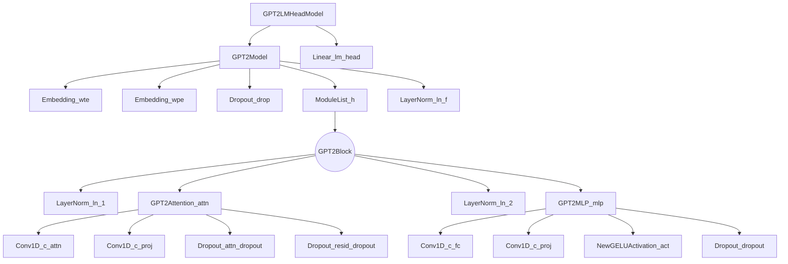

# Model Analysis GPT-2 Dutch Medium

- [Model Analysis GPT-2 Dutch Medium](#model-analysis-gpt-2-dutch-medium)
  - [Model description](#model-description)
    - [General Information](#general-information)
    - [Use Cases](#use-cases)
    - [Notable Achievements](#notable-achievements)
    - [Pre-trained Dataset](#pre-trained-dataset)
    - [Model Architecture](#model-architecture)
    - [References](#references)
  - [Tests](#tests)
    - [200 Epochs - RTX 3060 (12GB VRAM)](#200-epochs-rtx-3060-12gb-vram)
      - [Test Results](#test-results)
      - [Generated Text](#generated-text)


## Model description

### General Information

The GPT-2 Medium is a generative pre-trained transformer model developed by OpenAI. It is a larger variant of the GPT-2 family, containing 345 million parameters, which makes it more powerful than the GPT-2 Small but less computationally intensive than the GPT-2 Large and XL models. GPT-2 Medium has demonstrated impressive performance across various natural language processing (NLP) tasks, handling more complex language structures and producing more coherent outputs than the smaller GPT-2 variant.

In addition to its success with English, researchers have proposed methods to adapt the GPT-2 Medium model to other languages, such as Dutch. One of these methods has been applied to this model. By retraining the lexical embeddings without tuning the Transformer layers, the GPT-2 model has been adapted to understand and generate text in Dutch. This approach maintains the learned knowledge from the original GPT-2 model while minimizing the amount of training and preventing the loss of information during the adaptation process. As a result, the adapted GPT-2 Medium model can generate realistic Dutch sentences, demonstrating its versatility and potential in processing languages other than English.

### Use Cases

- Text generation: GPT-2 Medium can generate high-quality, human-like text by predicting the next word in a sequence given a starting prompt. It can be used for creative writing, drafting emails, generating marketing copy, or writing code.
- Summarization: The model can be fine-tuned to generate concise summaries of longer text passages, such as news articles, research papers, or meeting notes.
- Machine translation: GPT-2 Medium can be adapted for translating text between languages, providing more accurate translations than GPT-2 Small, especially for less common languages or complex sentences.
- Chatbots and virtual assistants: The model can power chatbot applications or virtual assistants, offering more contextually relevant and coherent responses in a conversational setting.
- Sentiment analysis: GPT-2 Medium can be fine-tuned to classify the sentiment of text data, helping businesses understand customer feedback or analyze social media reactions.

### Notable Achievements

Upon its release, GPT-2 Medium set a new benchmark in language modeling and NLP tasks. Its performance surpassed the GPT-2 Small and other models with similar sizes, achieving state-of-the-art results in various benchmarks. The GPT-2 Medium model's release further highlighted the potential of transformer-based models in NLP and contributed to the development of even more advanced models like GPT-3.

### Pre-trained Dataset

Dutch data consists of a combination of Wikipedia (2.0GB), newspaper articles (2.9GB), books (6.5GB) and articles from various Dutch news websites (2.1GB). Documents are filtered to only contain Dutch texts using the Wikipedia-trained fastText language identifier, and are deduplicated based on exact sentence matches. The final Dutch pre-training data contains 13GB of plain text, of which 5% is reserved as development data.[^1]

### Model Architecture



### References

- [Huggingface - Repository](https://huggingface.co/GroNLP/gpt2-medium-dutch-embeddings)
- [Arvix - As good as new. How to succesfully recycle english GPT2 to make models for other languages](https://arxiv.org/abs/2012.05628)

## Tests

### 200 Epochs - RTX 3060 (12GB VRAM)

In the following table you can find the results of the test. The test was performed on a RTX 3060 12GB GPU. The test was performed on a dataset of 396 songs and with 200 epochs. The dataset can be found [here](../evaluation_training_data/lyrics_400.csv)

#### Test Results

| Time (min) | Memory (MB) | Loss (Avg) |
| --- | --- | --- |
| 2:25 | 11520 | 5.058 |

#### Generated Text

```text
*ferry is een grappige man
smartlappen maken is zijn plan* te dansen met jou zo snel naar huis en liefde en jou niet van de liefde en liefde en ik je nog wat je je je armen van de liefde

ik wil je altijd aan mijn hart
ik leef me nog zo van huis

de avond
zijn het hart als je moeder en liefde zo ver van mij
en het leven als je niet vergeten
ik kijk je nu op jou niet
wat moet je vriend
zijn zij naar huis en tango parijsijs of geluk<|endoftext|endoftext|endoftext|>ik laat hem wat ik jou niet meer aan

jij hebt door de winter en jou

en dat je weet ik je maar jij nooit voorbij

ik wou
ik wil je ogen

van de zon in mij
zij weet ik je nooit meer
wat die liefde die je voor jou moet je arm<|>ik wil je hart
want ik in mn hart moet je me aan de liefde en je bent de liefde en ik je hart
zijn het niet meer
hou je bent zo jong als ik de zon maar niet meer
en
de hemel
als ik het een beetje meer
een kind<
```

[^1]: https://aclanthology.org/2021.findings-acl.74