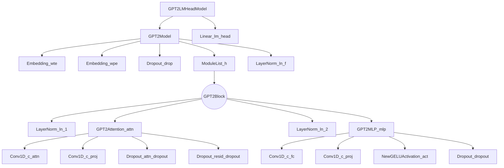

# Model Analysis GPT-2 Dutch Small

- [Model Analysis GPT-2 Dutch Small](#model-analysis-gpt-2-dutch-small)
  - [Model description](#model-description)
    - [General Information](#general-information)
    - [Use Cases](#use-cases)
    - [Notable Achievements](#notable-achievements)
    - [Pre-trained Dataset](#pre-trained-dataset)
    - [Model architecture](#model-architecture)
    - [References](#references)
  - [Tests](#tests)
    - [200 Epochs - RTX 3060 (12GB VRAM)](#200-epochs-rtx-3060-12gb-vram)
      - [Test Results](#test-results)
      - [Generated Text](#generated-text)


## Model description

### General Information
The GPT-2 Small is a generative pre-trained transformer model developed by OpenAI. It is the smallest variant of the GPT-2 family, with 117 million parameters. While it is less powerful than its larger siblings (e.g., GPT-2 Medium, Large, and XL), GPT-2 Small has demonstrated impressive performance in various natural language processing (NLP) tasks while maintaining a lower computational footprint.

In addition to its success with English, researchers have proposed methods to adapt the GPT-2 Small model to other languages, such as Dutch. One of these methods has been applied to this model. By retraining the lexical embeddings without tuning the Transformer layers, the GPT-2 model has been adapted to understand and generate text in Dutch. This approach maintains the learned knowledge from the original GPT-2 model while minimizing the amount of training and preventing the loss of information during the adaptation process. As a result, the adapted GPT-2 Small model can generate realistic Dutch sentences, demonstrating its versatility and potential in processing languages other than English.

### Use Cases

- Text generation: GPT-2 Small can be used to generate human-like text by predicting the next word in a sequence, given a starting prompt. This can be employed in tasks like creative writing, drafting emails, or generating marketing copy.
- Summarization: The model can be fine-tuned to create concise summaries of longer text passages, which can be useful for news article summarization, research paper abstracts, or summarizing meeting notes.
- Machine translation: GPT-2 Small can be adapted for translating text from one language to another, providing reasonably accurate translations for common languages.
- Chatbots and virtual assistants: The model can be used to power chatbot applications, providing contextual and relevant responses in a conversational manner.
- Sentiment analysis: GPT-2 Small can be fine-tuned to classify the sentiment of text data, helping businesses understand customer feedback or analyze social media reactions.

### Notable Achievements

When GPT-2 Small was released, it showcased a significant improvement over its predecessor, GPT, in terms of language modeling capabilities. It demonstrated state-of-the-art performance on several benchmarks, outperforming models with similar sizes. Additionally, it helped pave the way for more powerful models, such as GPT-3, which further advanced the field of NLP.

### Pre-trained Dataset

Dutch data consists of a combination of Wikipedia (2.0GB), newspaper articles (2.9GB), books (6.5GB) and articles from various Dutch news websites (2.1GB). Documents are filtered to only contain Dutch texts using the Wikipedia-trained fastText language identifier, and are deduplicated based on exact sentence matches. The final Dutch pre-training data contains 13GB of plain text, of which 5% is reserved as development data.[^1]

### Model architecture



### References 

- [Huggingface - Repository](https://huggingface.co/GroNLP/gpt2-small-dutch-embeddings)
- [Arvix - As good as new. How to succesfully recycle english GPT2 to make models for other languages](https://arxiv.org/abs/2012.05628)

## Tests

### 200 Epochs - RTX 3060 (12GB VRAM)

In the following table you can find the results of the test. The test was performed on a RTX 3060 12GB GPU. The test was performed on a dataset of 396 songs and with 200 epochs. The dataset can be found [here](../evaluation_training_data/lyrics_400.csv)

#### Test Results

| Time (min) | Memory (MB) | Loss (Avg) |
| --- | --- | --- |
| 1:19 | 7727 | 3.009 |

#### Generated Text

```text
*ferry is een grappige man
smartlappen maken is zijn plan*

jij als vrouw

ik leef voor jou

ik wil het je leven

ik ga niet alleen van je heen
ik leef voor jou
ik wil het je leven
ik wil het je leven
ik ga niet alleen van je heen
ik leef voor jou
ik wil het je leven
ik wil het je leven
ik wil het je leven
ik wil het je leven
ik wil het je leven
ik ga niet alleen van je heen
ik leef voor jou
ik wil het je leven
ik wil het je leven
ik wil het je leven
ik wil het je leven
ik wil het je leven
ik ga niet alleen van je heen
ik leef voor jou
ik wil het je leven
ik wil het je leven
ik wil het je leven
ik wil het je leven
ik wil het je leven
ik wil het je leven
ik ga niet alleen van je heen
ik leef voor jou
ik wil het je leven
ik wil het je leven
ik wil het je leven

ik wil het je leven
ik wil het je leven
i wil het je leven
ik wil het je leven
ik wil het je
```

[^1]: https://aclanthology.org/2021.findings-acl.74