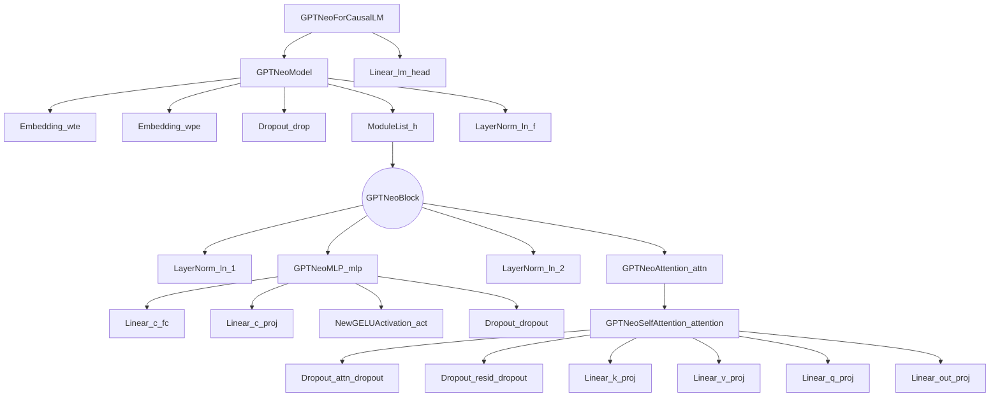

# Model analysis GPT-Neo 125M Dutch

- [Model analysis GPT-Neo 125M Dutch](#model-analysis-gpt-neo-125m-dutch)
  - [Model description](#model-description)
    - [General Information](#general-information)
    - [Use Cases](#use-cases)
    - [Notable Achievements](#notable-achievements)
    - [Pre-trained Dataset](#pre-trained-dataset)
    - [Model Architecture](#model-architecture)
    - [References](#references)
  - [Tests](#tests)
    - [200 Epochs - RTX 3060 (12GB VRAM)](#200-epochs-rtx-3060-12gb-vram)
      - [Test Results](#test-results)
      - [Generated Text](#generated-text)

## Model description

### General Information

The GPT-Neo 125M is a generative pre-trained transformer model developed by EleutherAI, an independent research organization focused on advancing artificial intelligence research. The GPT-Neo 125M, with 125 million parameters, is the smaller variant in the GPT-Neo family, which also includes the GPT-Neo 2.7B model. The GPT-Neo models are designed as an open-source alternative to proprietary models like GPT-3, aiming to foster a more collaborative approach to AI development. Despite its smaller size, the GPT-Neo 125M has demonstrated remarkable performance in various natural language processing (NLP) tasks.

### Use Cases

- Text generation: GPT-Neo 125M can generate high-quality, human-like text based on a given prompt, making it suitable for creative writing, drafting emails, generating marketing copy, or writing code.
- Summarization: The model can be fine-tuned to create concise summaries of longer text passages, such as news articles, research papers, or meeting notes.
- Machine translation: GPT-Neo 125M can be adapted for translating text between languages, providing reasonably accurate translations for common languages.
- Chatbots and virtual assistants: The model can be used to power chatbot applications, offering contextually relevant and coherent responses in a conversational setting.
- Sentiment analysis: GPT-Neo 125M can be fine-tuned to classify the sentiment of text data, helping businesses understand customer feedback or analyze social media reactions.

### Notable Achievements

The GPT-Neo 125M model has made strides in the democratization of AI research by offering an open-source alternative to proprietary models. Its performance in various NLP tasks has demonstrated the potential of community-driven AI development. Furthermore, the GPT-Neo models have inspired other organizations and researchers to create and share their work in a more open manner, fostering a collaborative environment for AI advancement.

### Pre-trained Dataset

This model was trained on of the full configuration (33B tokens) of cleaned Dutch mC4[^1], which is the original mC4, except

- Documents that contained words from a selection of the Dutch and English List of Dirty Naught Obscene and Otherwise Bad Words are removed
- Sentences with less than 3 words are removed
- Sentences with a word of more than 1000 characters are removed
- Documents with less than 5 sentences are removed
- Documents with "javascript", "lorum ipsum", "terms of use", "privacy policy", "cookie policy", "uses cookies", "use of cookies", "use cookies", "elementen ontbreken", "deze printversie" are removed.

### Model Architecture



### References

- [Huggingface - GPT-Neo 125M pre-trained on cleaned Dutch mC4](https://huggingface.co/yhavinga/gpt-neo-125M-dutch)
  
## Tests

### 200 Epochs - RTX 3060 (12GB VRAM)

In the following table you can find the results of the test. The test was performed on a RTX 3060 12GB GPU. The test was performed on a dataset of 396 songs and with 200 epochs. The dataset can be found [here](../evaluation_training_data/lyrics_400.csv)

#### Test Results

| Time (min) | Memory (MB) | Loss (Avg) |
| --- | --- | --- |
| 1:21m | 6048 | 5.747 |

#### Generated Text

```text
*ferry is een grappige man
smartlappen maken is zijn plan*
want geen vrouw en voor jou
nog een ander
het is een beetje goed

de tijd
ohoh manio met me
ik word te vertellen


en ik de tijd
zo zal je mij
ik wil ik van jouw eigen schat


nu wordt niet

t is n een beetje
tal van jou te stil
het is niet te vertellen
dus is weer bij jou voor mij
je bent
dat zegt je zegt ik zeg mn hart al ben ik en dan in weg
de man als ik jou wil je mij


geef je bent dat jij en je denkt ik dat is het staat mn hart naar de toekomst van jou

shalalalalal ben jij wel van jou de tijd
want ik in de nacht een goed


want ik moet jij te weten jij
je bent ik je bent ik heb jij mijn tranen
de mooiste en ben mij

t is het is echt samen
jij
de liefde is weer dat je naar hem
toen jij je hebt alles voor jou


want ik jou
eoom
wat was er al jou
hij bent aan
de
```

[^1]: https://huggingface.co/datasets/yhavinga/mc4_nl_cleaned